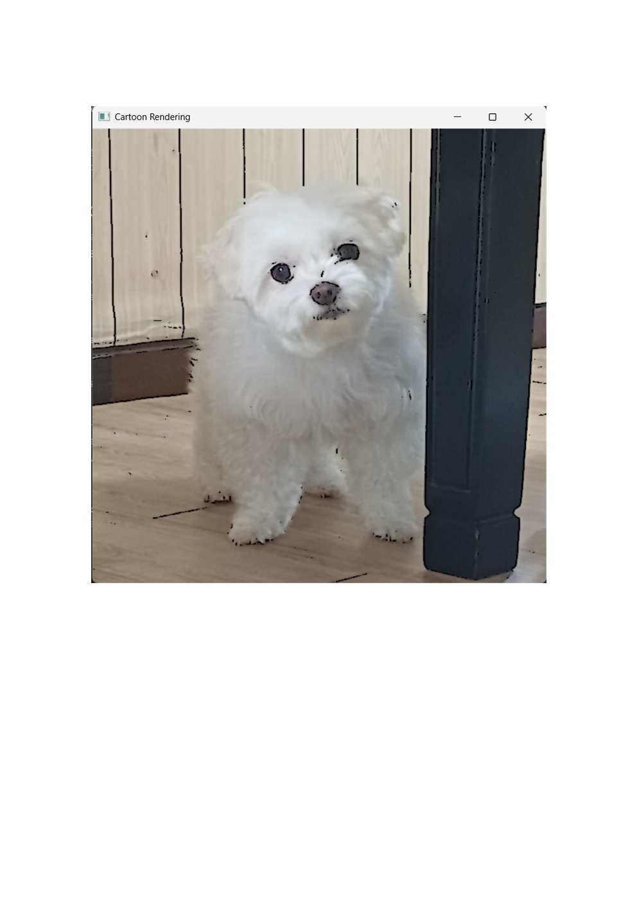

# Cartoon Rendering Using OpenCV

이 프로그램은 OpenCV 라이브러리를 사용하여 강아지 이미지를 만화 스타일로 렌더링하는 Python 스크립트입니다. 

## 기능 설명

- **이미지 로드**: 'Mong.jpg' 파일을 로드합니다.
- **회색조 변환**: 이미지를 회색조로 변환하여 엣지 검출을 준비합니다.
- **노이즈 제거**: 가우시안 블러를 적용하여 노이즈를 제거합니다.
- **엣지 검출**: 적응형 임계값(adaptiveThreshold)을 사용하여 엣지를 검출합니다.
- **컬러 부드럽게 하기**: 양방향 필터(bilateralFilter)를 적용하여 컬러 이미지를 부드럽게 합니다.
- **만화 효과 결합**: 엣지와 부드러운 컬러 이미지를 결합하여 만화 렌더링 효과를 만듭니다.
- **결과 표시**: 창에 만화 스타일의 이미지를 표시합니다.

