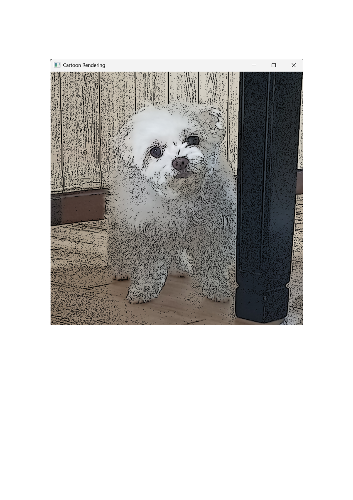
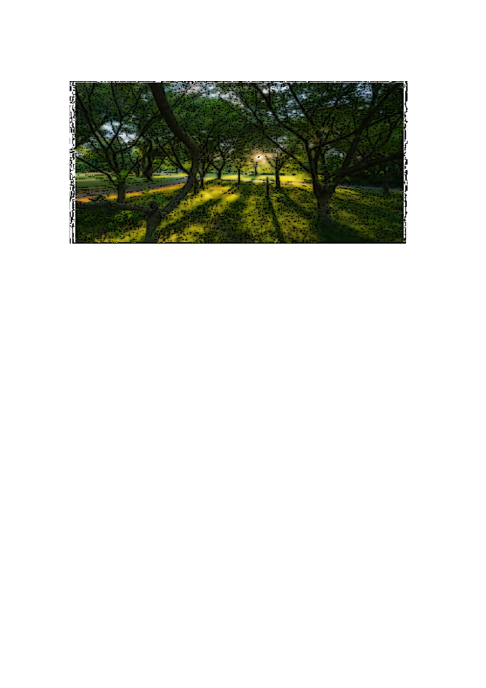

# Cartoon Rendering Using OpenCV

이 프로그램은 OpenCV 라이브러리를 사용하여 강아지 이미지를 만화 스타일로 렌더링하는 Python 스크립트입니다. 

## 기능 설명

- **이미지 로드**: 'Mong.jpg' 파일을 로드합니다.
- **회색조 변환**: 이미지를 회색조로 변환하여 엣지 검출을 준비합니다.
- **히스토그램 평활화**: 회색조 이미지의 대비를 향상시킵니다.
- **샤프닝 필터**: 샤프닝 커널 설정으로 이미지를 선명하게 만듭니다.
- **노이즈 제거**: 가우시안 블러를 적용하여 노이즈를 제거합니다.
- **엣지 검출**: 적응형 임계값(adaptiveThreshold)을 사용하여 엣지를 검출합니다.
- **컬러 부드럽게 하기**: 양방향 필터(bilateralFilter)를 적용하여 컬러 이미지를 부드럽게 합니다.
- **만화 효과 결합**: 엣지와 부드러운 컬러 이미지를 결합하여 만화 렌더링 효과를 만듭니다.
- **결과 표시**: 창에 만화 스타일의 이미지를 표시합니다.
- **만화 같은 느낌이 잘 표현되는 이미지(우리집 강아지)**

- **만화 같은 느낌이 잘 표현되지 않는 이미지(자연 사진)**

## 이 프로그램의 한계점
- **GaussianBlur의 이상치 취약**: Median을 활용하는 함수에 비해 평균을 이용하는 가우시안 함수는 이상치에 영향을 더 많이 받습니다.
- **회색조로의 변환**: 회색으로 변환해서 처리를 하다보니 컬러 이미지만의 경계 또는 질감의 특징은 무시되고 단순 밝기 기반으로만 판단됩니다.
- **고정 parameter**: parameter값의 고정으로 입력되는 이미지들마다 결과값이 많이 달라질 수 있습니다.

